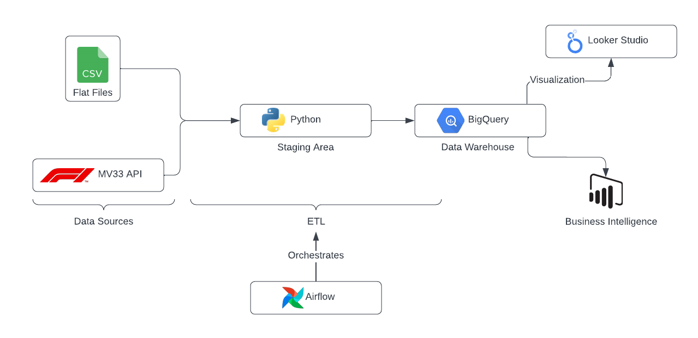

# F1_Data_Warehouse

## This project uses MV33_API as a data source. Necessary ETL pipelines are created using Python. They are all orchestrated using Airflow. The data is stored in the Big Query Data warehouse. Data will soon be visualized using Looker Studio.